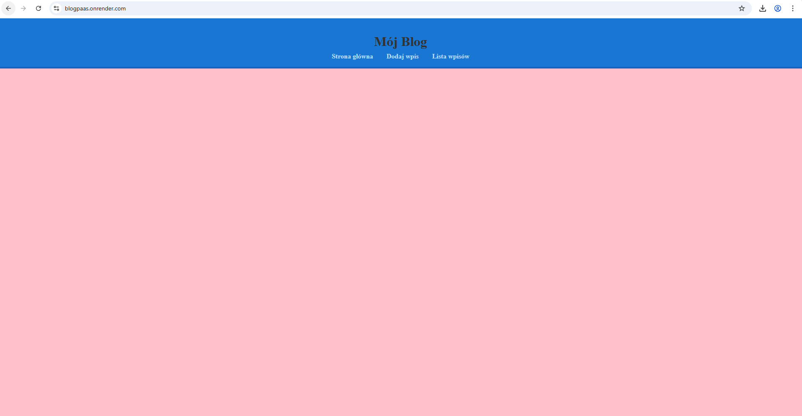
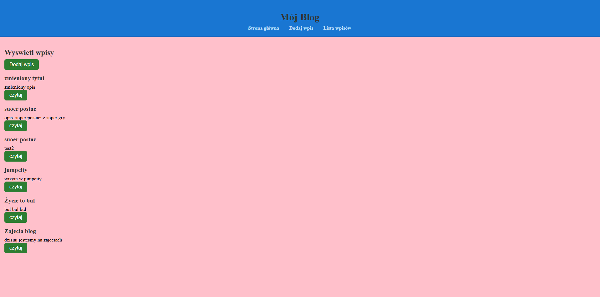
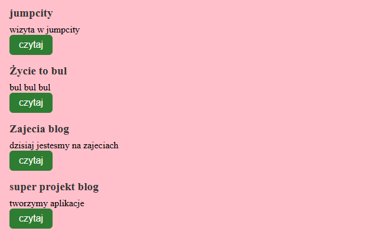
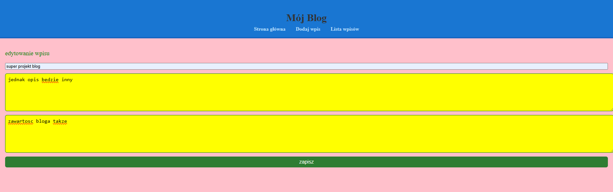
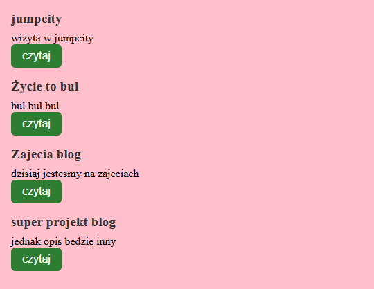
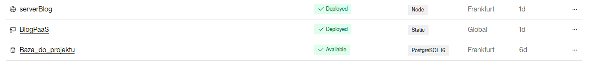
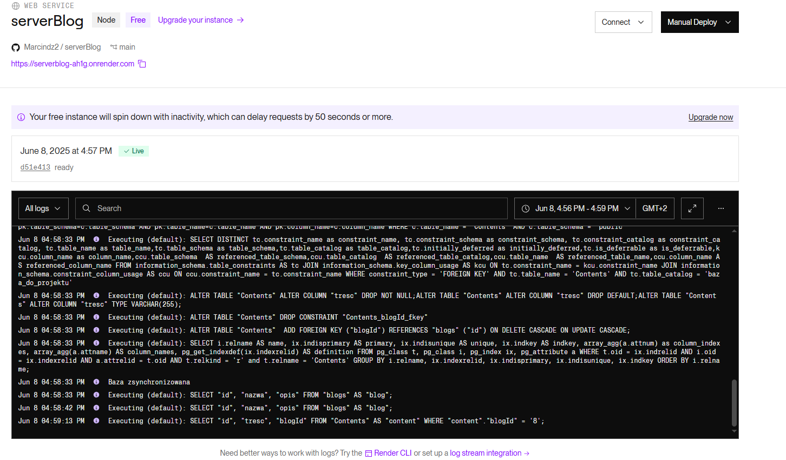
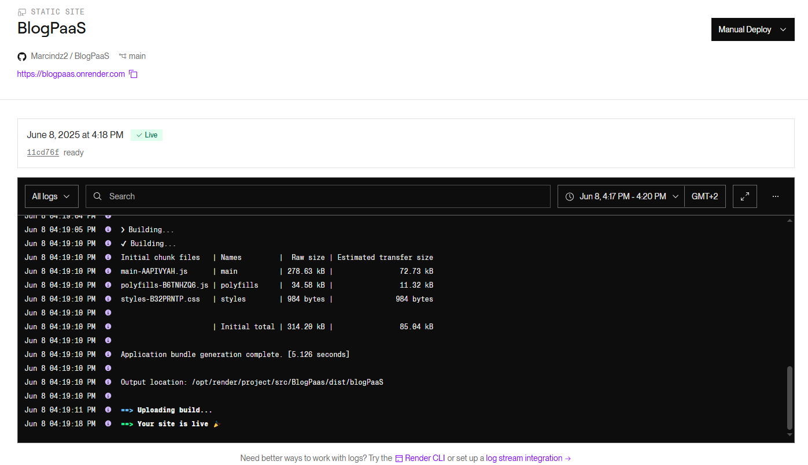

aplikacja blog, czesc serwerowa dodana jest do osobnego repozytorium 
<a href="https://github.com/Marcindz2/serverBlog">repozytorium serwera</a> 

<a href="https://blogpaas.onrender.com/">strona glowna</a> 

wyswietlone wpisy

dodawanie

wyswietlenie

edycja

po zmianie

render

serwer

blog 

